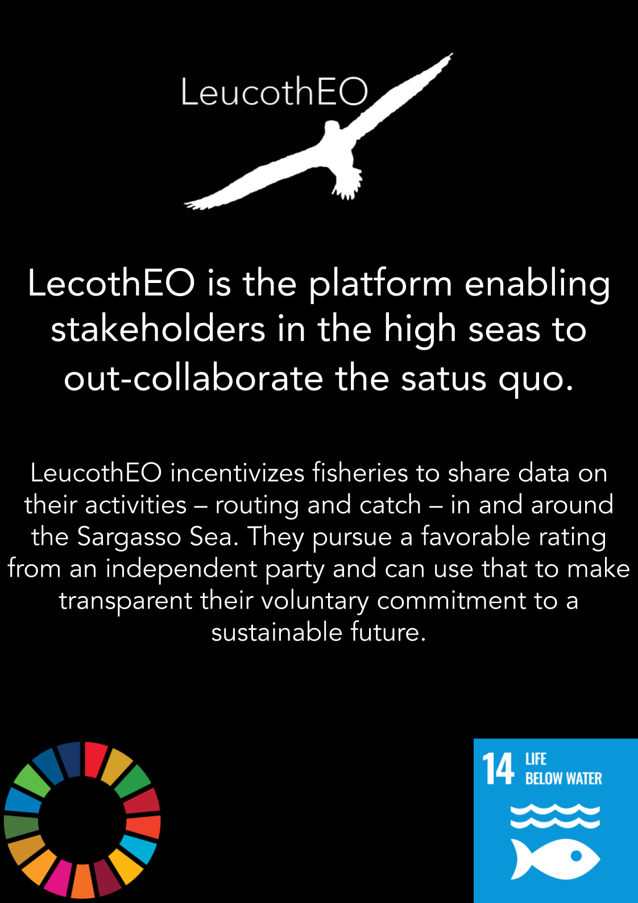

# LeucothEO - A CEVEN.protect Project

## Project Overview

| Project name        | LeucothEO                                                     |
| :------------------ | ------------------------------------------------------------  |
| Title               | Incentivizing data sharing on the high seas                   |
| Product demo        | https://www.leucotheo.org                                   |
| Twitter        | https://twitter.com/leucotheo                                |
| Blog post           | TBA                                                           |
| Dissemination level | Public                                                        |
| Version             | 0.1                                                           |
| Text license        | This work is licensed under a Creative Commons Attribution-ShareAlike 4.0 International License |
| Software license    | GNU AFFERO GENERAL PUBLIC LICENSE 3.0                         |
| Status              | Work in progress                                              |

## Team 

CEVEN.protect is a collaboration between CEVEN and Space4Good

Team members: 
-   Elke Sauter
-   Lily Gonzalez
-   Lisa Broekhuizen
-   Shravan Shah
-   Yannick Zehnder

## The Problem

The Sargasso Sea is a fragile ecosystem. Due to its location, it is hard to monitor, hard to protect, but essential to understanding more about the dynamics of human-nature interaction. A dramatic increase in fishing vessels in the Sargasso Sea's eastern part within less than ten years made observers curious of the ships' activities in the area. We will shine a light on that stage!

## The Solution

We want to incentivize fisheries to share their data on routes and catch in and around the Sargasso Sea. By self-reporting their activities in the area of interest, the fisheries can gain a favorable rating and open up a communication channel to establish common ground with other stakeholders in the area.
In the B2B market, buyers and sellers alike can refer to a transparent, trustworthy, and controlled single source of truth to prove their will to do good. Responsible buyers can sort out the responsible actors from those unwilling to act sustainably.
The solution will be presented in a simple front-end that allows easy access to publicly visible data.

## The Vision

In a self-governing environment with incentivized behavior, fisheries in and around the Sargasso Sea (and other marine ecosystems) motivate the market's sell and buy-side to act sustainably.
A global governance platform makes sure that our children and grandchildren still get to admire the wonders of the oceans and eat healthy fish at the same time. Based on transparent and immutable data recorded by fisheries and backed up by remote sensing and earth observation data for two-factor confirmation, the fishing industry embraces technology for a green future. 

## UN Sustainable Developmet Goals

We regard the UN SDG as a holistic, interlocked system of dependencies. Nevertheless, we focus on Goal 14, "Life Below Water," as our main incentive to develop our solution.
We encourage responsible, sustainable, and inclusive behavior by providing incentives, transparency, and communication channels between stakeholders in the Sargasso Sea ecosystem.

## Pilot Goal

Provide first user experience on the fishery reporting system and the two-factor vessel validation system via optical remote sensing methods. Visualize dashboards accessible for Marine Governance bodies (Sargasso Sea Commission) for overall monitoring and the reporting system for Auditing Entities that enable them to provide rankings for fisheries and resulting incentives for different stakeholders.

## Whats Next?

- Explore data sources for live monitoring
- Develop on the user interface
- Start onboarding users for rapid testing and real time feedback loops

## Credits

Thanks and shoutouts to:

- The Odyssey Team (https://www.odyssey.org/) 
- Alexander Gunkel (https://www.space4good.com/)
- The Sargasso Sea Commission (http://www.sargassoseacommission.org/)

------
